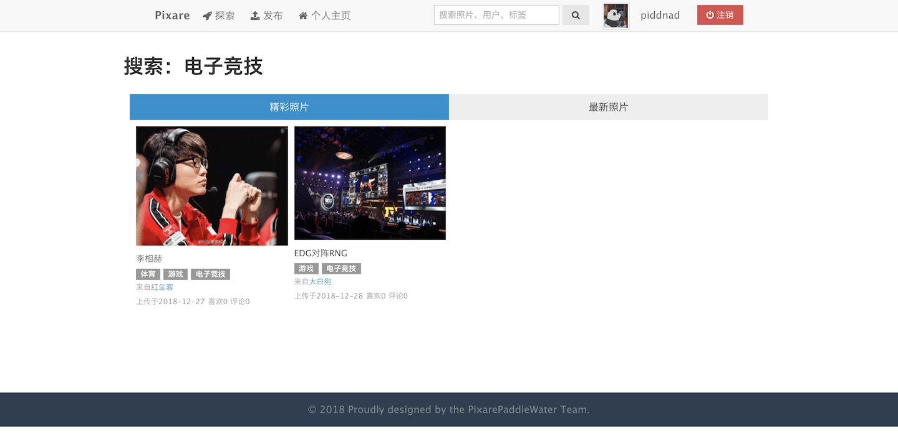

# Pixare - 分享你的生活！

> Edit in 2018.12.28

基于 Django + HTML5 + AmazeUI 的图片分享网站，大四上课程大作业。

### 产品背景
* 我们处在一个快节奏的信息时代，图片的一目了然使其更有吸引力；
* 越来越多的人开始爱好摄影，想要分享身边的美好。为他们提供一个分享自己作品的平台；
* 已存在的大多数图片网站，图片风格太过单一，而且部分更注重社交而不是图片分享本身。

### 产品定位
开放的社交图片分享平台

### 主要功能
1. 用户管理
    * 用户注册
    * 用户登录
    * 修改用户信息、用户头像
2. 图片上传
    * 添加图片信息
    * 添加图片标签
3. 图片展示
    * 最新 - 根据时间顺序展示
    * 排行榜 - 根据受欢迎程度展示（采取某种评分算法）
    * 搜索 - 搜索图片、标签、用户
4. 图片交互
    * 查看图片详细信息
    * 点赞、评论、关注

### 开发环境
* Python 3.6
* Django 2.1.2
* Pillow 5.3.0
* qiniu 7.2.2（使用七牛图床存储上传图片）

### 预览截图
欢迎页

探索页

个人主页

评论页

搜索结果页

### 参考项目&致谢
https://github.com/restran/green-glow

